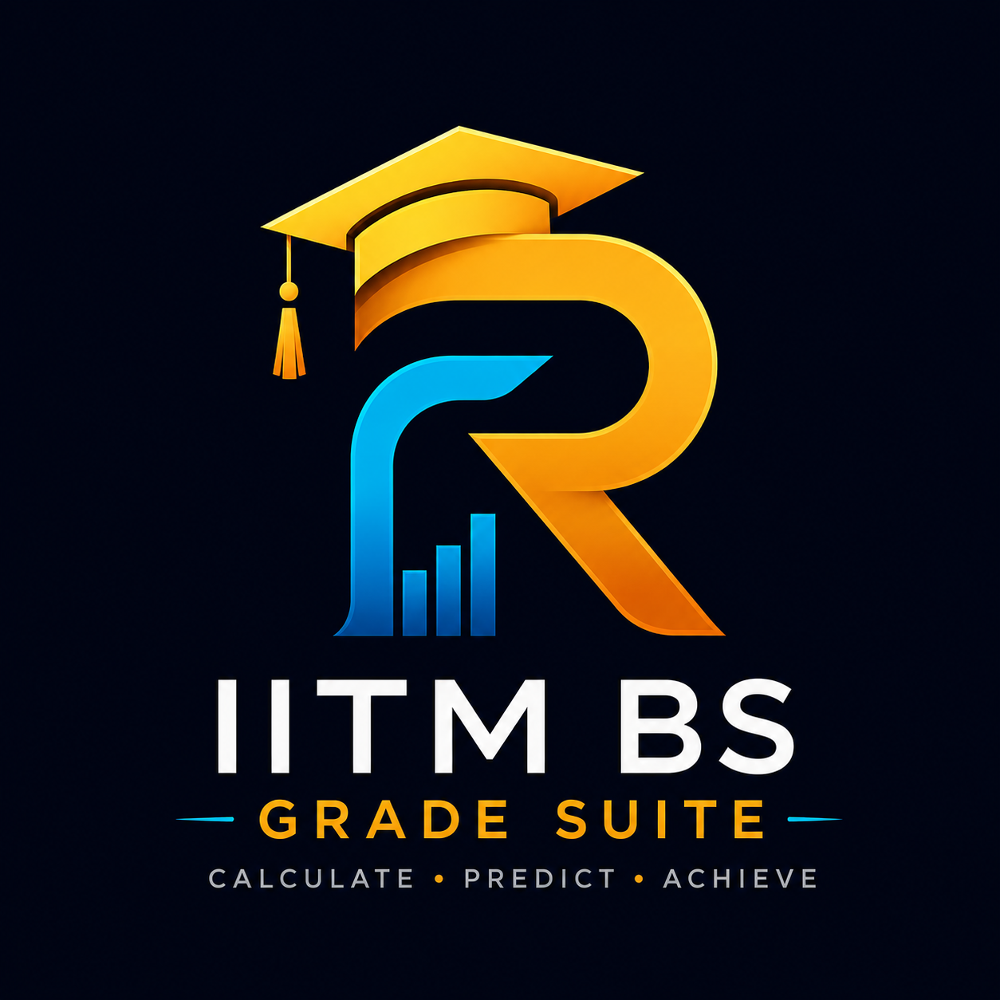

# 🎓 IITM BS Grade Suite

A modern, production-ready academic companion for students of the **IIT Madras BS in Data Science & Applications** program.

Calculate grades, predict end-term requirements, and track CGPA accurately using official grading formulas — all in a fast, responsive, and beautifully designed web app.

---

## ✨ Features

### 🎯 Grade Calculator

* Accurate course-wise grade calculations
* Supports quizzes, assignments, OPPEs, projects, and end terms
* Dynamic bonus system support
* Detailed score breakdowns
* Official grade cutoffs (S/A/B/C/D/E/U)

### 📈 Grade Predictor

* Predict required End Term marks
* Supports all grade targets
* Handles bonus logic accurately
* Detects impossible grade scenarios
* Precision-based calculations

### 🏆 CGPA Calculator

* Weighted CGPA computation
* Persistent local storage support
* Import/export JSON support
* Duplicate and retake handling
* Project course support

### 🔒 Production Features

* Responsive mobile-first design
* Security-focused architecture
* XSS-safe rendering
* Accessibility improvements
* Optimized performance
* Cloudflare Pages ready

---

## 🖼️ Preview



---

## 🛠️ Tech Stack

* HTML5
* CSS3
* Vanilla JavaScript
* LocalStorage
* Responsive Design
* Cloudflare Pages

---

## 📐 Grade System

| Grade | Points |
| ----- | ------ |
| S     | 10     |
| A     | 9      |
| B     | 8      |
| C     | 7      |
| D     | 6      |
| E     | 4      |
| U     | 0      |

CGPA Formula:

```text
CGPA = Σ(Credit × Grade Point) / Σ(Credits)
```

---

## 🎁 Bonus System

* Most courses support bonus marks up to **5**
* Some special courses (like Math 2) support bonus up to **6**
* Bonus applies only if base score ≥ 40
* Grade Calculator and Predictor use identical logic

---

## 📱 Responsive Experience

Optimized for:

* Mobile
* Tablet
* Desktop
* Large displays

---

## 🔐 Security

This project includes:

* XSS sanitization
* Secure JSON import validation
* Safe DOM rendering
* LocalStorage protection

---

## 👨‍💻 Developer

### Rohit Kumar Pulamarasetty

* LinkedIn:
  [Rohit Kumar Pulamarasetty LinkedIn](https://www.linkedin.com/in/rohit-kumar-pulamarasetty/)

* Email:
  [rohitpulamarasetty@gmail.com](mailto:rohitpulamarasetty@gmail.com)

---

## ⚠️ Disclaimer

This is an unofficial student-made project created for IITM BS students.

Formulas are based on the Jan 2026 grading document and may change in future terms. Always verify with official IITM documentation.

---

## ⭐ Support

If you found this useful:

* Star the repository
* Share it with fellow IITM BS students
* Contribute improvements

---

Made with ❤️ for IITM BS students.
